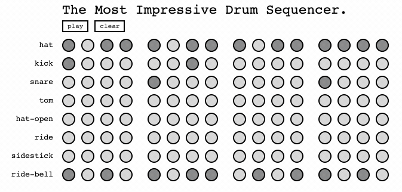

# The Most Impressive Drum Sequencer
A Coding Challenge for drum.io

## Approach

I broke the challenge into three parts:
- A functional interface that utilizes the javascript Audio API to play sounds and configure loops for various channels
- A user interface to provide interaction with the functional interface
- The actual instantiation of the above two interfaces

I really didn't want to use any libraries, so there are no frameworks or anything of that sort (for better or worse). Audio samples were downloaded from https://freesound.org/people/TicTacShutUp/packs/17/.

## Capabilities
- Configuration of the step sequence for each channel
- Play / Stop of all channels at 120 BPM
- Clear all steps across all channels
- Visualize the position of the sequencer as it plays

## Limitations
- The BPM can be set via the console (e.g. `sequencer.bpm = 240`), but there is not a UI component for doing so; in part this is because there are side effects adjusting this mid-flight that I did not wish to address at this point
- The sounds for each channel are hard coded
- The steps per beat is hard coded to 4 and the beats per bar is hard coded to 4

## Next Steps
- User adjustable BPM
- React or similar framework to cleanup and simplify the UI code
- Ability to adjust the steps per beat or beats per par
- Using the `AudioContext` API may yield more control of the audio and help to reduce artifact; furthermore, doing some type of realtime audio compositing may also help significantly towards that end
- Specs!

## Demo
What better than to demonstrate the functionality of an audio-based coding challenge than a silent movie? Alternatively, try it out [here]().

